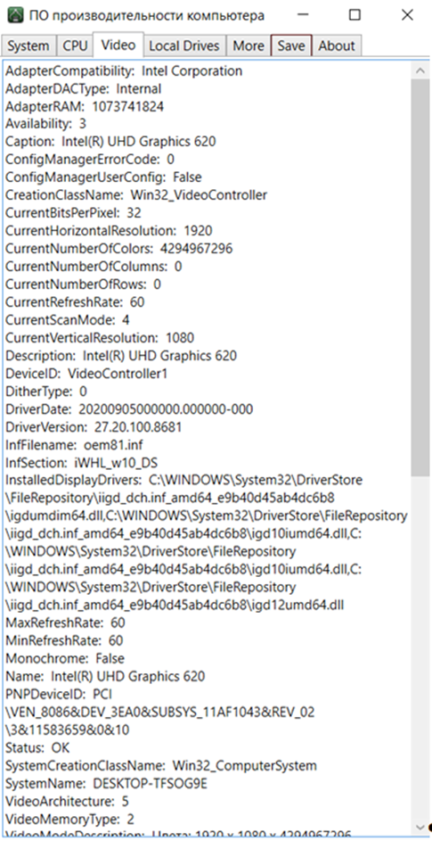

# **Программа для сбора информации о производительности ПК**
Данное приложение разработано с использованием языка программирования C#.
## **Описание**
Это приложение предназначено для сбора информации о производительности компьютера. Оно предоставляет простой интерфейс для получения данных о системе, процессоре, видеокарте, дисковой подсистеме и других аспектах производительности ПК.
## **Требования к окружению**
- Операционная система: Windows 10
- Среда разработки: Visual Studio 2019
- Язык программирования: C#
## **Используемые технологии**
- Язык программирования: C#
- Среда разработки: Visual Studio 2019
## **Функциональность**
Приложение предоставляет следующие возможности:

1. Сбор информации о системе, процессоре, видеокарте и дисковой подсистеме.
1. Возможность сохранения собранной информации в текстовый файл.
1. Пользовательский интерфейс, разработанный с использованием средств Visual Studio 2019.
## **Установка**
Для установки и запуска программы выполните следующие шаги:

1. Склонируйте репозиторий с помощью команды **git clone**.
1. Откройте проект в Visual Studio 2019.
1. Соберите проект и запустите приложение.
## **Использование**
1. Запустите приложение.
1. Используйте вкладки для просмотра информации о различных аспектах производительности ПК.
1. Для сохранения информации в текстовый файл нажмите кнопку "Сохранить" и выберите место сохранения файла.
## **Демонстрация работы**

